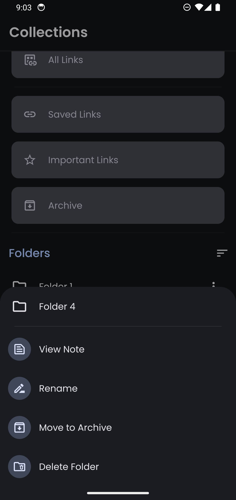
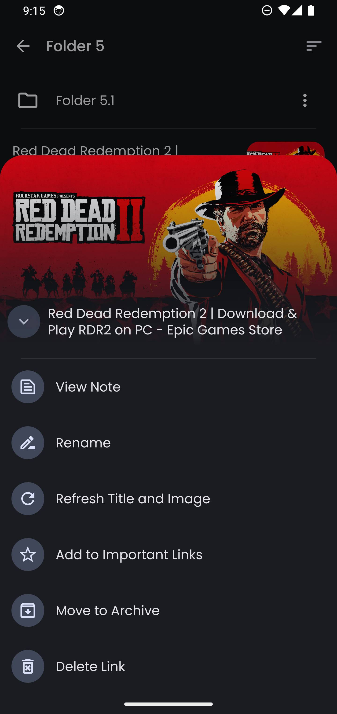

**Linkora** is the ultimate tool for organizing links on Android. Whether you need to save a quick link or manage them in detailed folders, Linkora gets it done.

## Download

[](https://github.com/sakethpathike/Linkora/releases) [](https://f-droid.org/packages/com.sakethh.linkora)


## Features

- Save and organize links with ease.
- Categorize links into folders and subfolders.
- Highlight important links for quick access.
- Archive old links to keep things tidy.
- Customize link names to your preference.
- Share directly from other apps.
- Sort and search links and folders quickly.
- Import and export data easily (this is being written and will be updated with the standard HTML-based schema).
- Auto-recognize link images and titles.
- Add folders to your **_Shelf_** for instant home screen access.
- Hindi language support, with remote string loading to update languages seamlessly. For details on contributing language strings, check [this guide](https://github.com/sakethpathike/LinkoraLocalizationServer/blob/master/README.md).

## Screenshots

|                                         |  |  |  |
|-----------------------------------------|-----------------------|-----------------------|-----------------------|
|  |  |  |  |
|  |  |  |  |

|                            Sharing links from other apps                            |
|:-----------------------------------------------------------------------------------:|
| <video src="https://github.com/user-attachments/assets/b1614d54-2df6-46d0-865a-f6ba16854c6c"></video> |

## Tech Stack

- **Kotlin**: Built entirely in Kotlin.
- **Jetpack Compose**: Fully Compose-based UI.
- **Material 3**: Modern Material design components.
- **Room**: Efficient local storage.
- **Kotlin Coroutines**: Smooth background processing.
- **Kotlin Flows**: For asynchronous data streams.
- **Kotlin Channels**: Real-time UI updates.
- **Kotlinx Serialization**: API response handling.
- **WorkManager**: Reliable background tasks (e.g., refreshing link metadata).
- **Coil**: Image loading.
- **Dagger Hilt**: Dependency Injection.
- **Architecture Components**: DataStore, Navigation, and ViewModel for structured development.

## FAQ

For frequently asked questions, refer to [FAQs](./wiki/FAQs.md).

## Join the Community

[](https://discord.gg/ZDBXNtv8MD)

## Contribute

Want to help improve Linkora? You can contribute by:

- Reporting issues
- Submitting pull requests
- Translating into other languages

For more on translating, check the [localization guide](https://github.com/sakethpathike/LinkoraLocalizationServer/blob/master/README.md).

## License

```
MIT License

Copyright (c) 2023 Saketh Pathike

Permission is hereby granted, free of charge, to any person obtaining a copy
of this software and associated documentation files (the "Software"), to deal
in the Software without restriction, including without limitation the rights
to use, copy, modify, merge, publish, distribute, sublicense, and/or sell
copies of the Software, and to permit persons to whom the Software is
furnished to do so, subject to the following conditions:

The above copyright notice and this permission notice shall be included in all
copies or substantial portions of the Software.

THE SOFTWARE IS PROVIDED "AS IS", WITHOUT WARRANTY OF ANY KIND, EXPRESS OR
IMPLIED, INCLUDING BUT NOT LIMITED TO THE WARRANTIES OF MERCHANTABILITY,
FITNESS FOR A PARTICULAR PURPOSE AND NONINFRINGEMENT. IN NO EVENT SHALL THE
AUTHORS OR COPYRIGHT HOLDERS BE LIABLE FOR ANY CLAIM, DAMAGES OR OTHER
LIABILITY, WHETHER IN AN ACTION OF CONTRACT, TORT OR OTHERWISE, ARISING FROM,
OUT OF OR IN CONNECTION WITH THE SOFTWARE OR THE USE OR OTHER DEALINGS IN THE
SOFTWARE.
```
