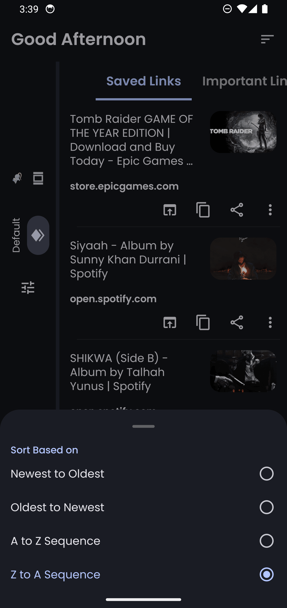
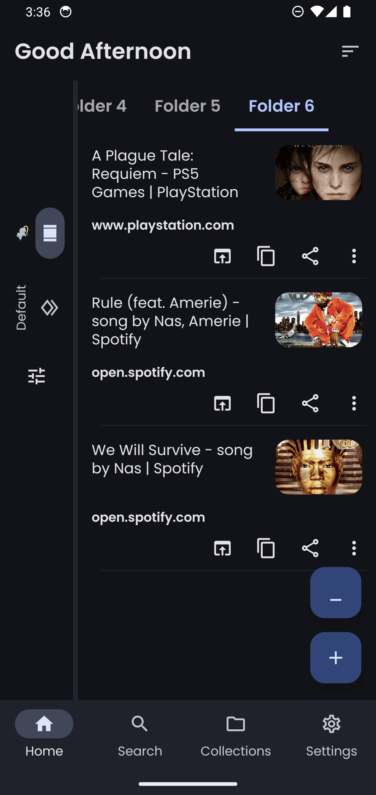
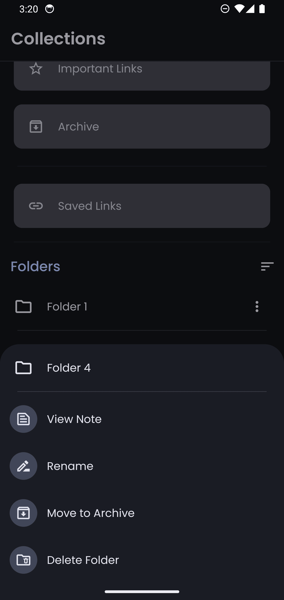
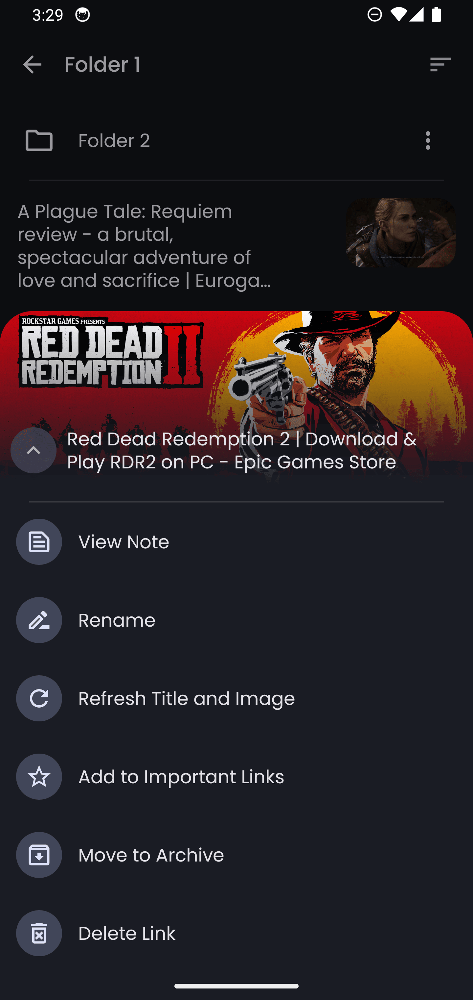
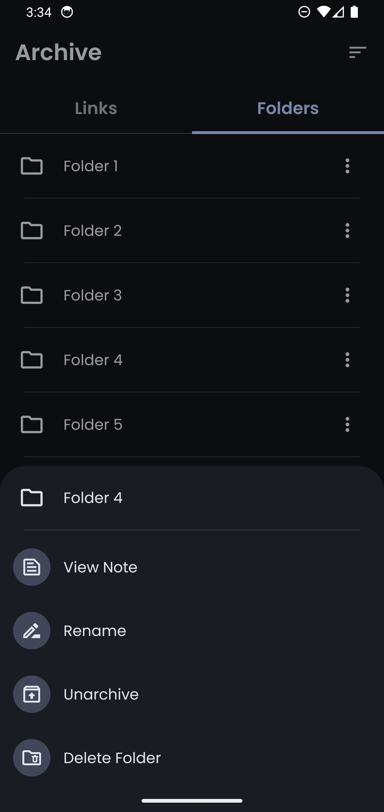
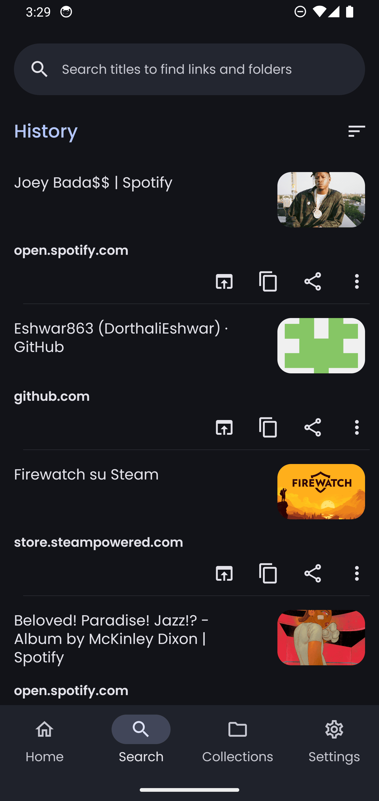
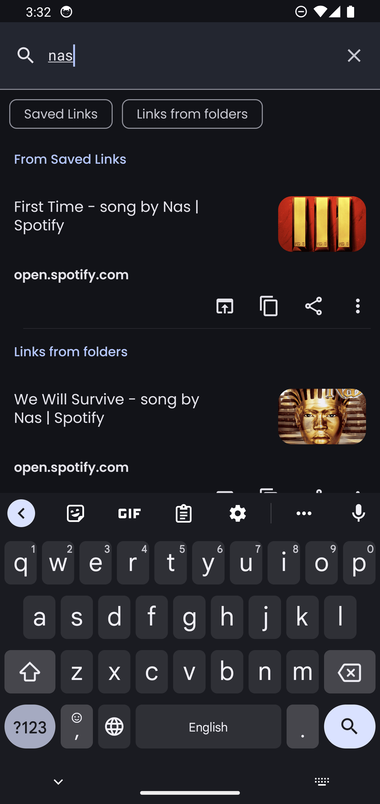
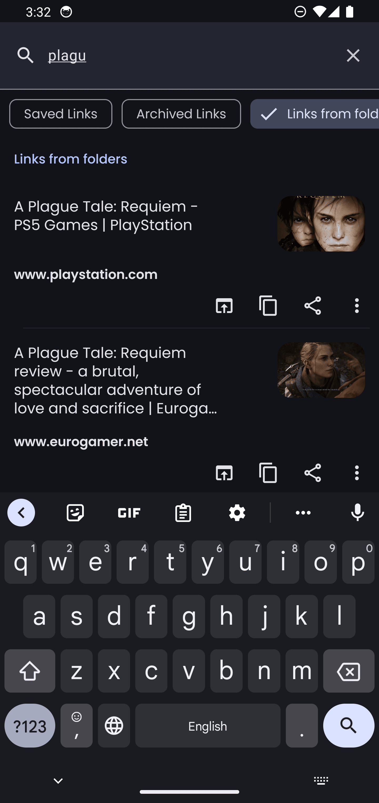
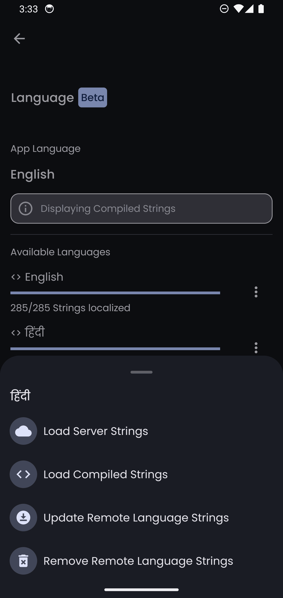

**Linkora** is your straightforward solution for organizing links on Android. Whether you’re saving a single link or categorizing them into folders, Linkora simplifies the process.

## Download

[](https://github.com/sakethpathike/Linkora/releases) [](https://f-droid.org/packages/com.sakethh.linkora)


## Features

- Save links effortlessly.
- Organize links into folders for a cleaner view.
- Create subfolders for detailed organization.
- Mark links as important for quick access.
- Archive old links or folders to keep your space clutter-free.
- Customize link names to fit your needs.
- Share links seamlessly from other apps.
- Quickly find and sort through your links and folders.
- Import and export your data.
- Linkora automatically recognizes images and titles when available.
- Customize your home screen by adding any folders you want to the **_Shelf_**, making it easy to
  access
  the most important ones.
- Linkora's latest update supports Hindi locally and features remote string loading, making it
  easier to add languages without app updates. To contribute language strings, please refer to [this guide](https://github.com/sakethpathike/LinkoraLocalizationServer/blob/master/README.md).

## Screenshots

|  |  |  |
|-----------------------|-----------------------|-----------------------|
|  |  |  |
|  |  |  |
|  |  |  |

|                            Sharing links from other apps                            |
|:-----------------------------------------------------------------------------------:|
| <video src="https://github.com/user-attachments/assets/49b5ff34-6b9d-4e85-8f93-fd6a762d782f"></video> |

## Tech Stack

- **Kotlin**: The project is developed entirely in Kotlin.
- **Jetpack Compose**: The UI is built with Jetpack Compose, making the project fully Compose-based.
- **Material 3**: Utilizes the latest Material 3 components for a modern UI.
- **Room**: Manages local data storage efficiently.
- **Kotlin Coroutines**: Handles background tasks efficiently.
- **Kotlin Flows**: Manages asynchronous data streams.
- **Kotlin Channels**: Sends events to the UI for real-time updates.
- **Kotlinx Serialization**: Parses API responses.
- **WorkManager**: Ensures reliable execution of tasks, such as refreshing links metadata in Linkora.
- **Coil**: Utilized for image loading.
- **Dagger Hilt**: Manages dependencies to simplify and organize dependency injection.
- **Architecture Components**: Utilizes DataStore, Navigation, and ViewModel to maintain project structure and functionality.


## Upcoming Updates

- [x] Sorting
- [x] Searching
- [x] Importing and exporting links
- [x] Improved title and image parsing for links
- [x] Sub-folders
- [ ] Backup data to cloud (Dropbox, Google Drive)
- [ ] Folder lock
- [ ] Read links from QR codes and text
- [x] Lists similar to Twitter Lists
- [x] Selectable items for different operations
- [x] Shelf on Home Screen
- [ ] Save multiple links with a single click
- [x] Translations
- [ ] Import links from other link management apps, including Raindrop and others


## Join the Community

[](https://discord.gg/ZDBXNtv8MD)

## Contribute

Contributions are welcome! You can help by:

- Reporting issues
- Submitting pull requests
- Contributing to language translations

For more details on contributing to language strings, please refer to the [localization guide](https://github.com/sakethpathike/LinkoraLocalizationServer/blob/master/README.md).

## License

```
MIT License

Copyright (c) 2023 Saketh Pathike

Permission is hereby granted, free of charge, to any person obtaining a copy
of this software and associated documentation files (the "Software"), to deal
in the Software without restriction, including without limitation the rights
to use, copy, modify, merge, publish, distribute, sublicense, and/or sell
copies of the Software, and to permit persons to whom the Software is
furnished to do so, subject to the following conditions:

The above copyright notice and this permission notice shall be included in all
copies or substantial portions of the Software.

THE SOFTWARE IS PROVIDED "AS IS", WITHOUT WARRANTY OF ANY KIND, EXPRESS OR
IMPLIED, INCLUDING BUT NOT LIMITED TO THE WARRANTIES OF MERCHANTABILITY,
FITNESS FOR A PARTICULAR PURPOSE AND NONINFRINGEMENT. IN NO EVENT SHALL THE
AUTHORS OR COPYRIGHT HOLDERS BE LIABLE FOR ANY CLAIM, DAMAGES OR OTHER
LIABILITY, WHETHER IN AN ACTION OF CONTRACT, TORT OR OTHERWISE, ARISING FROM,
OUT OF OR IN CONNECTION WITH THE SOFTWARE OR THE USE OR OTHER DEALINGS IN THE
SOFTWARE.
```
